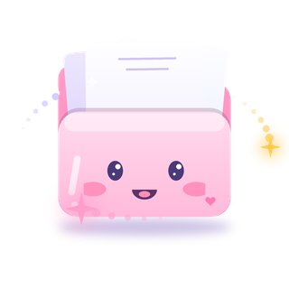

# ✨ Tidy for Mac — The Cutest, Deepest Mac Cleaner & Organizer

<div align="center">



### ✨ Clean your Mac. Organize your world. Fall in love with your desktop. ✨

[](https://swift.org)
[](https://apple.com/macos)
[](LICENSE)
[](https://github.com/Saketkesar/Tidy)
[](https://github.com/Saketkesar)

[Features](#-key-features) • [Icon Packs](#-icon-packs--customization) • [Installation](#-installation) • [Auto-Updates](#-auto-updates) • [Contact](#-developer--contact)

</div>

---

## 🎀 Why Tidy?

Most Mac cleaner apps are either clunky, aggressively dark, or secretly subscription traps filled with annoying fake progress bars.

**Tidy** is built differently:
- ✨ **Cute, Modern & Warm**: Crafted in native SwiftUI with a calming blush-pink & crisp clean aesthetic that makes disk maintenance feel like a cozy spa day.
- ⚡ **Lightweight & Blazing Fast**: Zero Electron bloat, zero background telemetry hogs. Uses Apple's native Grand Central Dispatch & async Swift routines.
- 🔒 **100% Offline & Private**: No analytics, no phoning home, no account signups. Everything stays strictly on your local Mac.
- 💖 **Completely Free & Unlocked**: No pro-tiers, no locked buttons, no paywalls. Built for the community with love.

---

## ✨ Key Features

### 🧹 1. Smart System Scan
One-click comprehensive disk diagnostic that scans app caches, user logs, orphan files, and download trash without touching your sensitive personal data.

### 🧼 2. Deep Cache & Junk Cleaner
Targeted scrubbing of:
- Application caches & developer frameworks (`DerivedData`, `CocoaPods`, `Homebrew`)
- System & diagnostic logs
- Safari, Chrome, and Brave browser debris
- Xcode simulators & temporary build caches

### 👯 3. Zero-Lag Duplicate Finder
Identifies byte-for-byte duplicate photos, songs, PDFs, and installers using fast size-indexing followed by SHA-256 chunk hashing. Compare duplicates side-by-side and keep the newest or oldest version with one tap.

### 📦 4. Large Files Hunter
Visual tree breakdown that reveals hidden gigabyte-hogging videos, disk images, and archives lurking in the darkest corners of your drive.

### 🚀 5. Complete App Uninstaller
Drag-and-drop or select any macOS app to delete not just the `.app` bundle, but also its hidden `Application Support`, `Saved Application State`, `Preferences`, and `Caches`.

### 🗂 6. Smart Downloads Organizer & Custom Folder Icons
Instantly sorts messy `~/Downloads` into clean, organized subfolders:
- `📂 Documents` • `🖼 Images` • `🎵 Audio` • `🎬 Video` • `📦 Archives` • `💻 Code` • `⚙️ Installers`
- Customize every folder with cute custom high-resolution icons!

### 🎨 7. Mac-Wide Icon Customizer & ZIP Library
- Change icons for **any folder, app, or file** across your whole Mac!
- Import ZIP icon packs directly (e.g. My Hero Academia, Cute Anime, Pastel Minimalist).
- Browse loaded packs in a high-res gallery and apply them with real macOS folder icon styling.

### ⚡️ 8. Segmented Multi-Connection Downloader
Turbocharge file downloads with parallel multi-part chunking! Includes a visual pastel segmented progress bar, pause/resume engine, and speed metrics.

---

## 🎨 Icon Packs & Customization

> [!TIP]
> ### 🌟 Wallpapers Clan Folder Icons Recommendation
> Check out **[Wallpapers Clan Folder Icons](https://wallpapers-clan.com/folder-icons/)**!
> 
> *“This is not sponsored, but I love it and it’s genuinely the best place for high-quality Mac folder icon packs, anime packs, and aesthetic desktop themes!”* — **Saket Kesar**
> 
> 
>
> You can download any `.zip` or `.icns` pack from Wallpapers Clan, drop it straight into Tidy's **Icon Customizer**, and dress up your desktop in seconds!

---

## 📥 Installation

### Option 1: Direct Download (DMG)
1. Download the latest **`Tidy.app`** or **`Tidy.dmg`** from the [GitHub Releases](https://github.com/Saketkesar/Tidy/releases) page.
2. Drag `Tidy.app` into your `/Applications` folder.
3. Open Tidy and enjoy!

### Option 2: Build From Source
Clone the repository and run the build script:

```bash
git clone https://github.com/Saketkesar/Tidy.git
cd Tidy
./scripts/build_app.sh
```

The production-ready `Tidy.app` will be compiled and packaged into `./dist/Tidy.app`.

---

## 🔄 Auto-Updates

Tidy includes a built-in update engine powered by GitHub Releases:
- Automatically notifies you when a new release tag is published.
- In-app **Check for Updates** button in Settings.
- Shows release notes, changelogs, and direct one-click download.

---

## 🤝 Community & Support

Have ideas, suggestions, or found a bug? We'd love to hear from you!

- 🐛 [Report a Bug](https://github.com/Saketkesar/Tidy/issues/new?title=%5BBug%5D+&labels=bug)
- 💡 [Suggest a Feature](https://github.com/Saketkesar/Tidy/issues/new?title=%5BFeature+Request%5D+&labels=enhancement)
- ⭐ [Star the Repo](https://github.com/Saketkesar/Tidy) to show some love!

---

## 🧑‍💻 Developer & Contact

**Created with ❤️ by Saket Kesar**

- 🌐 GitHub: [@Saketkesar](https://github.com/Saketkesar)
- 📬 Email: [saketkesar391@gmail.com](mailto:saketkesar391@gmail.com)
- 📁 Wallpapers Clan Icons: [wallpapers-clan.com/folder-icons](https://wallpapers-clan.com/folder-icons/)

---

## 📄 License

Distributed under the MIT License. See `LICENSE` for more information.
